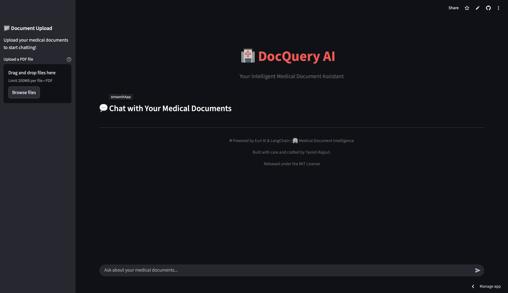

# DocQuery AI – AI-powered Medical Document Q&A using RAG and FAISS

**DocQuery AI** is an intelligent chatbot that allows users to upload medical PDF documents and chat with them. It uses **Retrieval-Augmented Generation (RAG)**, **FAISS** for vector search, and advanced language models to deliver accurate and context-aware answers.

---

## 🚀 Features
- ✅ **Upload PDFs** - Extract text using pypdf, if pages contain images then pytesseract (OCR) for text extraction.
- ✅ **Smart Document Search** – Uses FAISS for efficient vector-based retrieval.
- ✅ **Context-Aware Answers** – Retrieval-Augmented Generation ensures accurate responses.
- ✅ **Free-Form Chat** – Ask anything related to the uploaded documents.
- ✅ **Scalable Architecture** – Can be extended for multiple users and large datasets.

---

## 🔗 Live Demo
- 🌐 **Streamlit App:** [Link](https://docquery-ai-zm2p7pwwj3hya6gtqrxumf.streamlit.app)

---

## 🏗️ Tech Stack
- **Vector Database:** FAISS
- **Embedding Model:** Hugging Face model (sentence-transformers/all-mpnet-base-v2)
- **Language Model:** OpenAI GPT (gpt-4.1-nano)
- **Frontend:** Streamlit 
- **PDF Parsing:** pypdf + pytesseract (Image Parsing)

---

## 🔍 How It Works (Architecture)
1. **Upload PDFs** → Extract text using PDF parsers.
2. **Text Chunking** → Split text into chunks for better retrieval.
3. **Embeddings Generation** → Convert chunks into vector embeddings.
4. **Store in FAISS** → Efficient similarity search for queries.
5. **Query Processing** → Retrieve top matches using FAISS.
6. **Generate Answer** → Pass retrieved chunks to LLM for final response.

---

## ⚡ Installation
```bash
# Clone the repository
git clone https://github.com/tanishra/DocQuery-AI.git
cd docquery

# Create virtual environment
conda create -n venv 
conda activate venv

# Install dependencies
pip install -r requirements.txt
```

---

## ▶️ Usage
```bash
streamlit run main.py
```
- Upload your medical PDFs.
- Ask questions or chat with your documents.

---

## 📷 Screenshot



---

## ✅ Future Enhancements
- **Source Linking (Citations)** – Show document name and page number for each answer.
- **Confidence Score** – Display answer confidence based on FAISS similarity.
- **Document Summarization** – Generate quick summaries for uploaded PDFs.
- **Hybrid Search** – Combine keyword-based and semantic search for better results.
- **Voice-based Interaction** – Add Speech-to-Text and Text-to-Speech support.
- **External Medical Knowledge Integration** – Use PubMed or WHO data for extra context.
- **Analytics Dashboard** – Track user queries and most-referenced documents.

---

## 🤝 Contribution
I am open to feedback and contributions!
- Fork the repo and create a pull request.
- Feel free to use, test, and improve this project.
- If you like it, please give it a ⭐ on GitHub!


